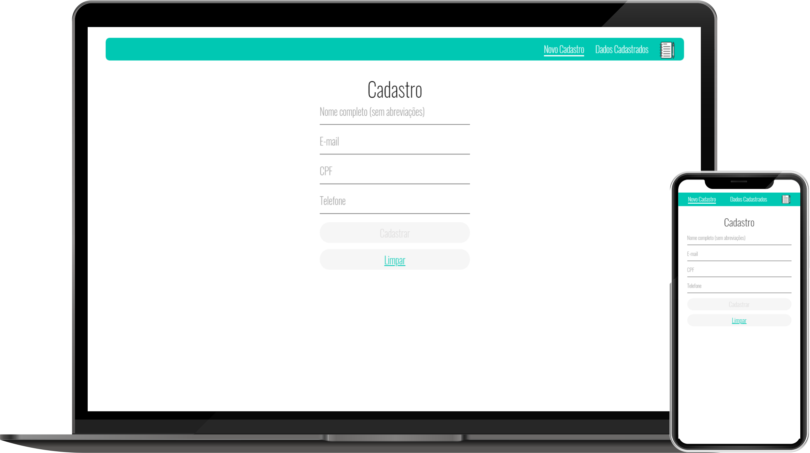
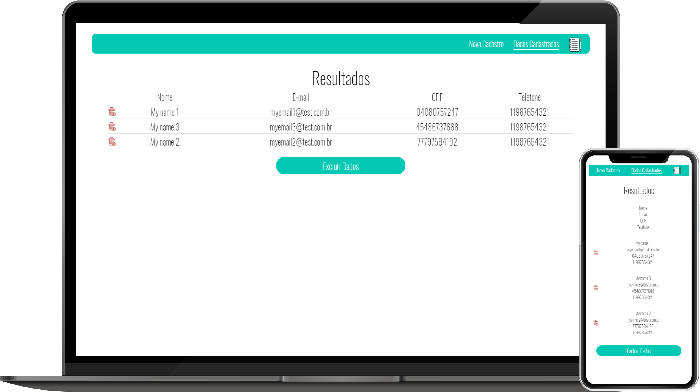
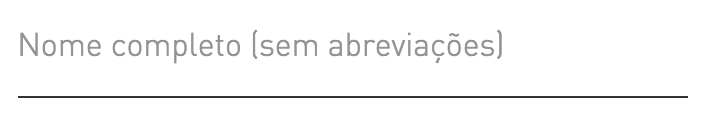
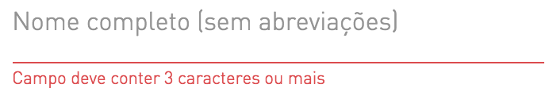
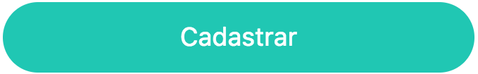
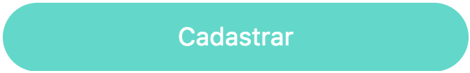
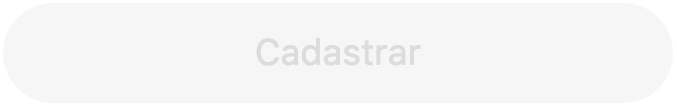
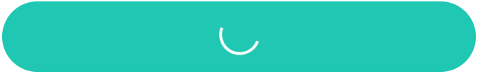
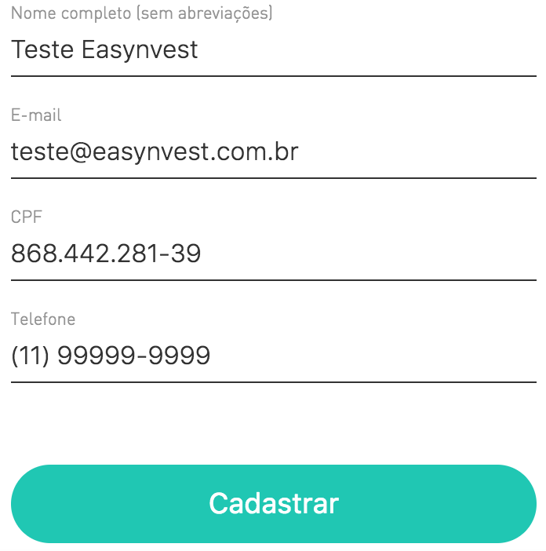

  <h1>Desafio Easynvest</h1>
  
Projeto desenvolvido com o intuíto de aprimorar minhas as habilidades de HTML, CSS e Javascript através de desafios reais. Este projeto retirado do repositório <a href="https://github.com/felipefialho/frontend-challenges">felipefialho/frontend-challenges</a> na qual possui uma lista de desafios Front-end.

  <a href="https://diaspaulo.github.io/Desafio-Easynvest/assets/index.html" target="_blank"><button type="button" style="margin: 50px 0; font-size: 1.75rem; text-align: center; height: 4rem; width: 500px; outline: none; border-radius: 12px; background-color: #FCA311; cursor: pointer;">Live Demo</button></a>

  

    
    
  

  <h1>Visão Geral do Projeto</h1>
  
  
  <h2>Teste de Front-end Easynvest</h2>
  
Este teste é apresentado aos candidatos as vagas de desenvolvimento Front-end para avaliar os quesitos técnicos.

  <h2>O Desafio</h2>
  
Seu objetivo é criar um simples app que deve conter duas páginas, uma que exibe um formulário com os campos abaixo, e outra que liste os dados cadastrados.

  <ul>
    <li>Nome completo</li>
    <li>CPF</li>
    <li>Telefone</li>
    <li>Email</li>
  </ul>

  <h3>Pré-requisitos:</h3>
  <ul>
    <li>Deve ser possível criar, listar e excluir os dados cadastrados pelo formulário;</li>
    <li>Os inputs de texto e botão devem ter a aparência conforme o guia de estilo abaixo (com validações);</li>
    <li>Fazer a persistência dos dados no `localStorage` ou `IndexedDB`;</li>
    <li>Não é permitido a utilização de nenhum framework ou o uso de qualquer biblioteca (exceto para testes unitário e tasks de build), recomendado uso de ECMAScript 6+;</li>
  </ul>

  
Para ter o estado inicial da lista de usuário utilizar este recurso abaixo:

  <cite style="display: block; margin-left: 20px; padding: 10px; background-color: #ccc">GET <a href="https://private-21e8de-rafaellucio.apiary-mock.com/users" style="color: #000">https://private-21e8de-rafaellucio.apiary-mock.com/users</a></cite>

  
Response:

  <pre><code style="color: #fff">[
  {
    "name": "My name 1",
    "cpf": "04080757247",
    "phone": "11987654321",
    "email": "myemail1@test.com.br"
  },
  {
    "name": "My name 2",
    "cpf": "77797584192",
    "phone": "11987654321",
    "email": "myemail2@test.com.br"
  },
  {
    "name": "My name 3",
    "cpf": "45486737688",
    "phone": "11987654321",
    "email": "myemail3@test.com.br"
  }
]</code></pre>

  
A partir deste ponto utilizar o `localStorage/IndexedDB` para persistir localmente as informações.

  
Save:

  <pre><code style="color: #fff">{
  "name": "My name 4",
  "cpf": "74668869066",
  "phone": "11987654321",
  "email": "myemail4@test.com.br"
}</code></pre>

  
Lista local:

  <pre><code style="color: #fff">[
  {
    "name": "My name 1",
    "cpf": "04080757247",
    "phone": "11987654321",
    "email": "myemail1@test.com.br"
  },
  {
    "name": "My name 2",
    "cpf": "77797584192",
    "phone": "11987654321",
    "email": "myemail2@test.com.br"
  },
  {
    "name": "My name 3",
    "cpf": "45486737688",
    "phone": "11987654321",
    "email": "myemail3@test.com.br"
  },
  {
    "name": "My name 4",
    "cpf": "74668869066",
    "phone": "11987654321",
    "email": "myemail4@test.com.br"
  }
]</code></pre>

  <h3>Plus:</h3>
  <ul>
    <li>A página ser responsiva;</li>
    <li>Permitir edição;</li>
    <li>Uso de pré-processador css;</li>
    <li>Testes End to End;</li>
  </ul>

  <h3>O que esperamos:</h3>
  <ul>
    <li>Testes, no mínimo testes unitários;</li>
    <li>Padrão de Projeto e boas práticas de Orientação a Objetos;</li>
    <li>Utilizar ECMAScript 6+;</li>
    <li>Criar um passo a passo de como rodar sua aplicação <a href="https://github.com/wearehive/project-guidelines/blob/master/README.sample.md">Sugestão</a>;</li>
    <li>Criar uma breve descrição da solução utilizada.</li>
  </ul>

  <h2>Guia de estilo</h2>

  <h3>Input:</h3>
  <ul>
    <li>Cor da fonte sem foco: *#efeeed*.</li>
    <li>Cor da fonte com foco: *#333333*.</li>
    <li>Cor da borda: *#efeeed*.</li>
  </ul>

  

  <h3>Input Inválido:</h3>
  <ul>
    <li>Cor da fonte: *#eb4a46*.</li>
    <li>Cor da borda: *#eb4a46*.</li>
  </ul>

  

  <h3>Botão Habilitado:</h3>
  <ul>
    <li>Cor da fonte com foco: *#ffffff*.</li>
    <li>Cor de background: *#00c8b3*.</li>
  </ul>

  

  <h3>Botão Hover:</h3>
  <ul>
    <li>Opacidade do botão com hover: 70%.</li>
  </ul>

  

  <h3>Botão Desabilitado:</h3>
  <ul>
    <li>Cor da fonte sem foco: *#dddcdc*.</li>
    <li>Cor de background: *#f6f6f6*.</li>
  </ul>

  

  <h3>Botão Loading:</h3>

  
  <figcaption style="font-style: italic;">*Criar animação de loading ao clicar no submit</figcaption>

  <h3>Exemplo Final</h3>

  
  
  
** Use sua criatividade para criar a página para listar os dados cadastrados **

  

    <a href="https://diaspaulo.github.io/Desafio-Easynvest/assets/index.html" target="_blank"><button type="button" style="font-size: 1.75rem; text-align: center; height: 4rem; width: 250px; outline: none; border-radius: 12px; background-color: #14213D; color: #FFF; cursor: pointer;">Live Link</button></a>
    <a href="https://github.com/diasPaulo/Desafio-Easynvest" target="_blank"><button type="button" style="font-size: 1.75rem; text-align: center; height: 4rem; width: 250px; outline: none; border-radius: 12px; background-color: #14213D99; color: #FFF; cursor: pointer;">Code Link</button></a>
  

